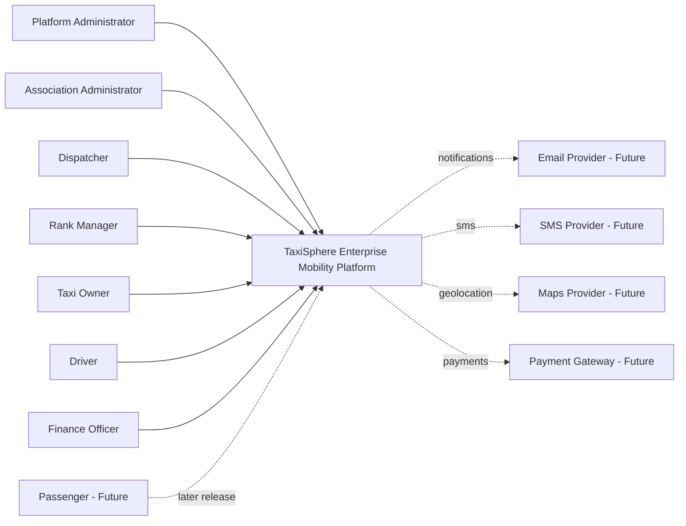
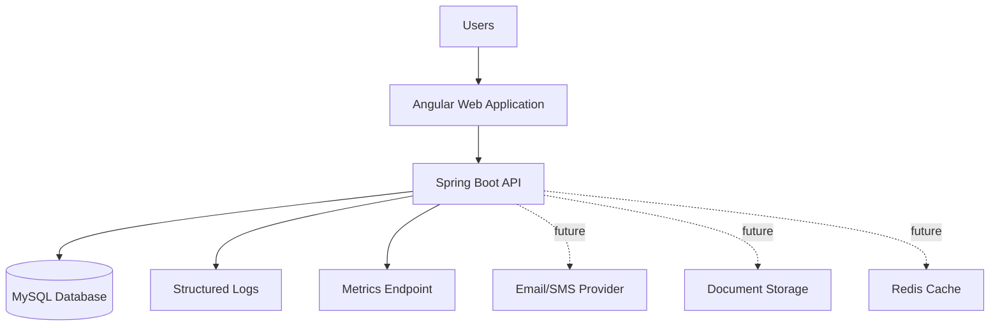
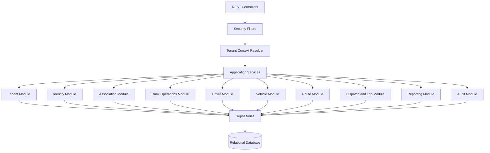

# TaxiSphere C4 Architecture Views

## Executive Summary

This document captures the initial C4 architecture views for TaxiSphere: system context, container view, and backend component view. These diagrams support TS-SAD-001 and will evolve as implementation begins.

## 1. System Context

## 2. Container View

## 3. Backend Component View

## 4. Diagram Rules

- C4 diagrams must stay aligned with TS-SAD-001.
- Container names must match deployable units.
- Component names must match backend module names where practical.
- Future integrations must be marked as future until implemented.
- Diagram changes that alter architecture intent should reference an ADR.
