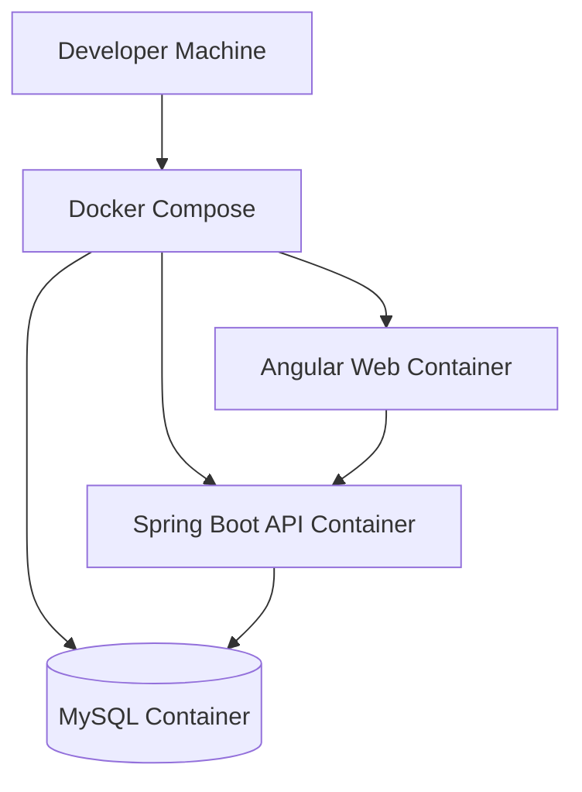
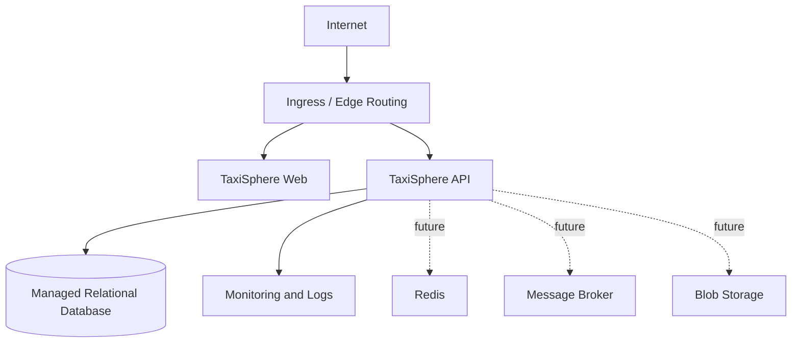

# TaxiSphere Deployment Architecture

## Executive Summary

TaxiSphere will start with a simple Docker-based deployment model and evolve toward Kubernetes on Azure. The deployment strategy keeps early development practical while preserving a clean path to production-grade operations.

## 1. Deployment Stages

| Stage | Purpose | Main Components |
| --- | --- | --- |
| Local Development | Developer productivity | Angular dev server, Spring Boot API, MySQL container |
| Local Docker | Integrated verification | Web container, API container, database container |
| Staging | Pre-production validation | Containerized app, managed or containerized database, logs, metrics |
| Production | SaaS operation | Azure-hosted web, API, database, monitoring, backup, security controls |

## 2. Local Docker View

## 3. Future Azure/Kubernetes View

## 4. Configuration Principles

- Use environment variables for deployment-specific configuration.
- Never commit secrets to source control.
- Keep local development defaults simple.
- Use separate configuration profiles for local, test, staging, and production.
- Use health checks for deployable services.

## 5. Release 1 Deployment Requirements

- Backend can run locally.
- Frontend can run locally.
- Database can run through Docker.
- API health endpoint exists.
- Basic logs are available from the API.
- Database migrations are repeatable.

## 6. Future Production Requirements

- TLS termination.
- Centralized logs.
- Metrics dashboards.
- Automated backups.
- Disaster recovery plan.
- Infrastructure as Code through Terraform.
- Container orchestration through Kubernetes.
- Secrets management.
