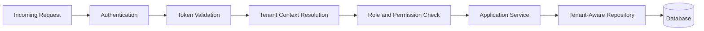

# TaxiSphere Security Architecture Overview

## Executive Summary

TaxiSphere security is centered on identity, role-based authorization, tenant isolation, secure defaults, and auditability. Because the platform is multi-tenant, tenant isolation is treated as a core security control rather than a normal application filter.

## 1. Security Goals

| ID | Goal |
| --- | --- |
| SG-001 | Authenticate every protected request. |
| SG-002 | Authorize every privileged action by role and permission. |
| SG-003 | Enforce tenant isolation across services, repositories, and reports. |
| SG-004 | Audit security-sensitive and business-critical actions. |
| SG-005 | Protect credentials and secrets. |

## 2. Request Security Flow

## 3. Tenant Isolation Rules

- Tenant-scoped data must never be fetched without tenant context.
- Tenant context must be resolved server-side.
- Tenant identifiers supplied by clients must not override authenticated context.
- Platform-level access must use explicit platform administration workflows.
- Cross-tenant access attempts must fail closed.
- Tenant isolation must be tested directly.

## 4. Role Model Baseline

| Role | Scope |
| --- | --- |
| Platform Administrator | Platform-level tenant and system administration. |
| Association Administrator | Tenant-level administration. |
| Rank Manager | Tenant rank and operational oversight. |
| Dispatcher | Tenant dispatch and trip workflows. |
| Taxi Owner | Tenant vehicle-related visibility. |
| Driver | Assigned driver workflows. |
| Finance Officer | Tenant reporting and revenue visibility. |
| Operations Manager | Tenant dashboards and operational reporting. |

## 5. Audit Scope

The system must audit:

- Login failure patterns.
- Tenant creation, activation, suspension, and deactivation.
- User creation, deactivation, and role changes.
- Driver and vehicle compliance changes.
- Route changes.
- Trip dispatch, cancellation, and completion.
- Security authorization failures.

## 6. Security Architecture Constraints

- Passwords must be hashed with an approved one-way algorithm.
- Secrets must not be committed to the repository.
- Protected APIs must reject unauthenticated access.
- Tenant-owned data access must be reviewed during code review.
- Security-sensitive changes should reference ADR-004 or a future security ADR.
