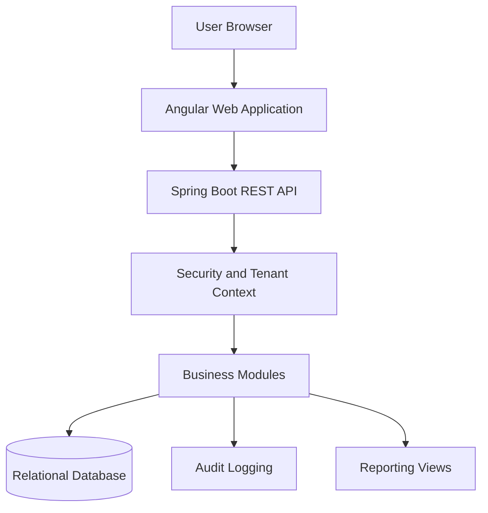
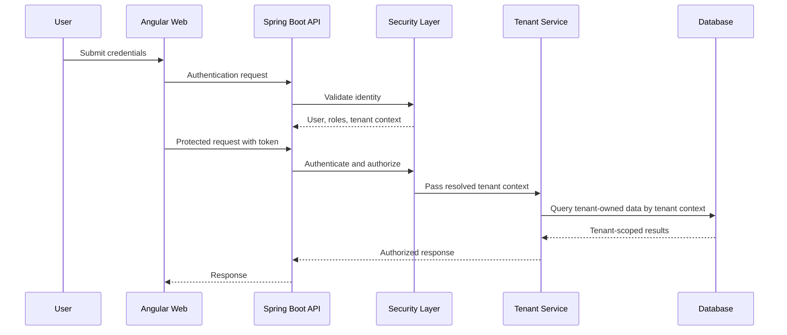

# TaxiSphere Software Architecture Document

## Document Control

| Field | Value |
| --- | --- |
| Document ID | TS-SAD-001 |
| Version | 0.1.0 |
| Status | Draft |
| Owner | Solution Architecture Office |
| Source Documents | TS-BRD-001, TS-SRS-001, TS-DOM-002, ADR-001, ADR-002, ADR-003 |

## Executive Summary

TaxiSphere is designed as a cloud-ready, multi-tenant SaaS platform implemented first as a modular monolith. The architecture prioritizes tenant isolation, maintainable module boundaries, secure access control, operational visibility, and a practical path toward future service extraction.

The Version 1 architecture uses one Angular web application, one Spring Boot backend application, one relational database, and clearly separated internal business modules.

## 1. Architecture Goals

| ID | Goal |
| --- | --- |
| AG-001 | Support multiple taxi associations as isolated tenants. |
| AG-002 | Keep Version 1 simple enough for a small team to build and operate. |
| AG-003 | Organize code around business capabilities and bounded contexts. |
| AG-004 | Enforce authentication, authorization, tenant resolution, and audit logging. |
| AG-005 | Support local Docker deployment and future Kubernetes/Azure deployment. |
| AG-006 | Enable future module extraction when justified by scale or team needs. |

## 2. Architecture Decisions

| ADR | Decision | Architecture Impact |
| --- | --- | --- |
| ADR-001 | Adopt Multi-Tenant SaaS | Every tenant-owned operation must resolve and enforce tenant context. |
| ADR-002 | Adopt Modular Monolith | One deployable backend with strict internal module boundaries. |
| ADR-003 | Adopt Technology Stack Baseline | Java/Spring Boot backend, Angular frontend, MySQL database, Docker-first delivery. |
| ADR-004 | Authentication and Authorization Strategy | Centralized identity, JWT, RBAC, tenant-aware authorization. |
| ADR-005 | Database and Tenant Isolation Strategy | Shared database/schema with tenant ownership on tenant-scoped records. |
| ADR-006 | API Design Standards | REST APIs documented with OpenAPI and consistent error handling. |
| ADR-007 | Observability Strategy | Structured logging, metrics, audit signals, and future dashboards. |

## 3. Architecture Style

TaxiSphere Version 1 uses a modular monolith:

- One backend deployable unit.
- One frontend web application.
- One relational database.
- Internal modules aligned to bounded contexts.
- Controlled service interfaces between modules.
- No direct cross-module database ownership.

This keeps early development practical while preserving the option to extract modules into services later.

## 4. Logical Architecture

## 5. Backend Module Model

| Module | Responsibility |
| --- | --- |
| Platform Management | Platform configuration and global administration. |
| Tenant Management | Tenant lifecycle, activation, suspension, and tenant metadata. |
| Identity and Security | Authentication, authorization, roles, permissions, and tenant context. |
| Association Management | Association profile and operating configuration. |
| Rank Operations | Rank records, queue visibility, and operational rank state. |
| Driver Management | Driver profile, compliance, availability, and assignment constraints. |
| Vehicle Management | Vehicle profile, ownership, compliance, availability, and utilization. |
| Route Management | Routes, fares, stops, distance, and route status. |
| Dispatch and Trip Management | Dispatch workflow, trip lifecycle, passenger count, revenue, and status. |
| Reporting and Analytics | Operational reports, KPIs, dashboards, and future analytics. |
| Audit | Security-sensitive and business-critical event recording. |
| Notifications | Email and future SMS/push notification workflows. |

## 6. Tenant Isolation Architecture

Tenant context must be resolved once a protected request is authenticated. Tenant-owned application services and repositories must use that context for all tenant-scoped operations.

Rules:

- Tenant identity is not trusted from client-provided request parameters when authenticated context already contains tenant ownership.
- Tenant-owned records must belong to exactly one tenant.
- Platform administrators may manage tenants through explicit platform workflows.
- Cross-tenant access must be denied by default.
- Tenant isolation must be covered by automated tests.

## 7. Security Architecture

## 8. Data Architecture

The initial persistence model uses a shared relational database and shared schema. Tenant-owned tables must carry tenant ownership, normally through a `tenant_id` field or a required relationship to a tenant-owned aggregate.

The database design must support:

- Referential integrity.
- Tenant-scoped indexes.
- Audit fields.
- Soft delete where auditability matters.
- Optimistic locking where concurrent updates are likely.

## 9. API Architecture

TaxiSphere APIs are REST-based and documented with OpenAPI.

API principles:

- Resource-oriented endpoints.
- JSON request and response bodies.
- Consistent validation errors.
- Consistent problem responses.
- Tenant context resolved server-side.
- Versioned API paths, starting with `/api/v1`.

## 10. Observability Architecture

The platform must produce enough operational signals to diagnose failures and understand usage.

Minimum signals:

- Authentication successes and failures.
- Authorization failures.
- Tenant activation and suspension.
- Driver, vehicle, route, and trip changes.
- Trip dispatch and completion events.
- API latency and error rate.
- Database connectivity health.

## 11. Deployment Architecture

Release 1 starts with Docker-based local deployment and evolves toward Kubernetes and Azure.

Initial deployment units:

- Angular web application.
- Spring Boot API.
- MySQL database.
- Optional local supporting services when introduced later.

## 12. Architecture Constraints

- Version 1 must remain a modular monolith.
- Major technology changes require ADR approval.
- Tenant isolation is mandatory.
- Direct module-to-module database manipulation is prohibited.
- Business logic must not be placed in shared utility code.
- External integrations must use adapters or anti-corruption layers.

## 13. Quality Attribute Scenarios

| Quality Attribute | Scenario | Target |
| --- | --- | --- |
| Security | User from Tenant A attempts to access Tenant B data. | Request is denied and event is logged. |
| Performance | Operations manager opens a dashboard. | Common dashboard views target under 2 seconds. |
| Maintainability | New driver workflow is added. | Change stays within Driver and related application services. |
| Scalability | New association is onboarded. | No new deployment is required. |
| Reliability | Trip completion request misses required data. | Request is rejected with validation details. |

## 14. Future Evolution

Modules may become independent services when justified by:

- Independent scaling needs.
- Separate team ownership.
- Distinct deployment cadence.
- Clear operational boundaries.
- Measured performance pressure.

Candidate future services include Notifications, Payments, Reporting, and AI Analytics.

## 15. Related Documents

- TS-BRD-001: Business Requirements Document.
- TS-SRS-001: Software Requirements Specification.
- TS-DOM-002: Bounded Context Map.
- ADR-001: Multi-Tenant SaaS.
- ADR-002: Modular Monolith Architecture.
- ADR-003: Technology Stack Baseline.
