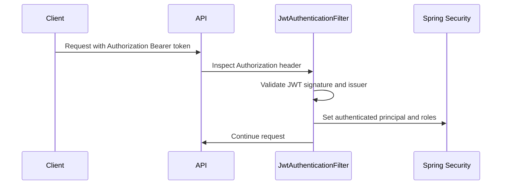

# TS-BCK-007 — Bearer JWT Request Authentication

## Purpose

This document defines the request authentication filter that allows TaxiSphere APIs to authenticate users through Bearer JWT tokens.

## Request Flow

## Security Behavior

- Requests without Bearer tokens continue to normal Spring Security handling.
- Requests with invalid Bearer tokens receive `401 Unauthorized`.
- Valid tokens populate the Spring Security context.
- Valid tenant-scoped tokens populate the request tenant context.
- Security and tenant contexts are cleared after every request.

## Current Compatibility

HTTP Basic remains enabled for the bootstrap platform administrator while the application authentication flow matures.
