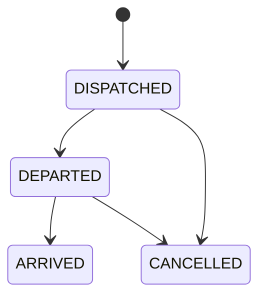

# TS-BCK-017 — Trip Lifecycle Actions

## Purpose

This document defines the first trip lifecycle actions after dispatch.

## Endpoints

| Method | Path | Roles | Purpose |
| --- | --- | --- | --- |
| POST | `/api/v1/trips/{tripId}/depart` | `ASSOCIATION_ADMIN`, `OPERATIONS_MANAGER`, `RANK_MANAGER`, `DISPATCHER` | Mark a dispatched trip as departed |
| POST | `/api/v1/trips/{tripId}/arrive` | `ASSOCIATION_ADMIN`, `OPERATIONS_MANAGER`, `RANK_MANAGER`, `DISPATCHER` | Mark a departed trip as arrived |
| POST | `/api/v1/trips/{tripId}/cancel` | `ASSOCIATION_ADMIN`, `OPERATIONS_MANAGER`, `RANK_MANAGER`, `DISPATCHER` | Cancel a dispatched or departed trip |

## Valid Transitions

## Business Rules

- Only `DISPATCHED` trips can depart.
- Only `DEPARTED` trips can arrive.
- `DISPATCHED` and `DEPARTED` trips can be cancelled.
- `ARRIVED` and `CANCELLED` trips are terminal for this release.
- Lifecycle actions are always tenant-scoped.
